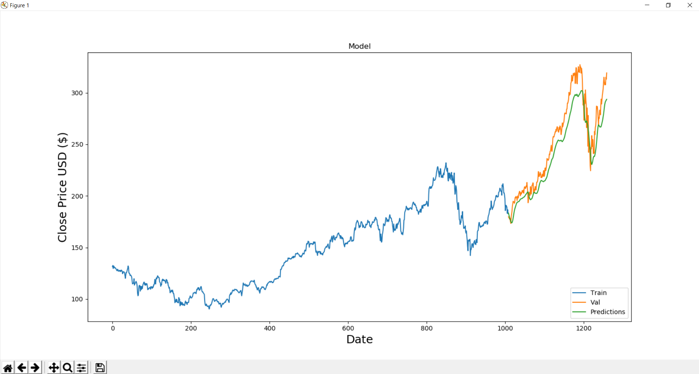
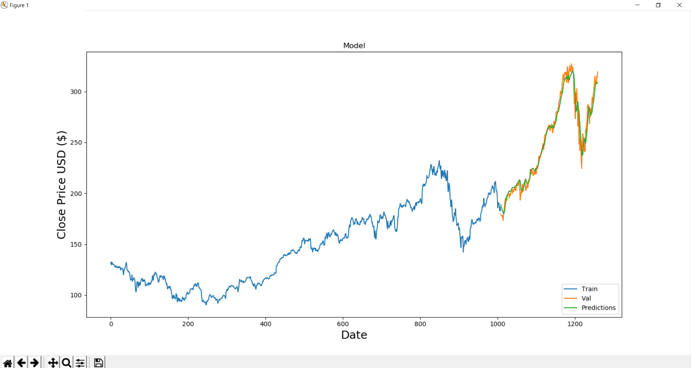
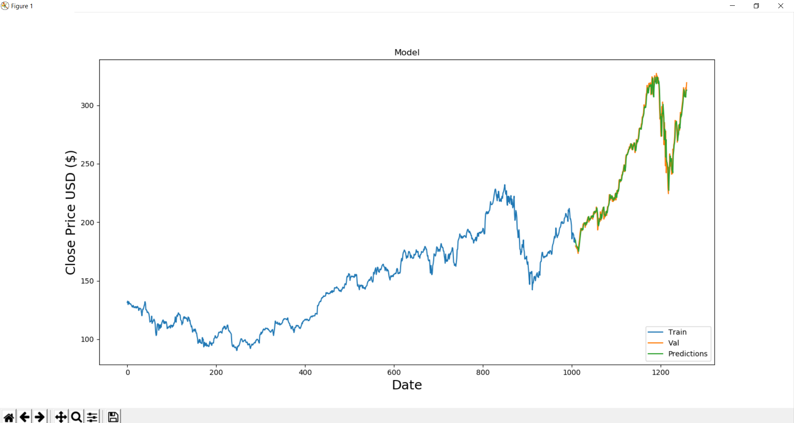

# Stock Market Prediction Using LSTM Neural Networks

## Abstract

This research project implements a deep learning approach to predict stock market prices using Long Short-Term Memory (LSTM) neural networks. The model analyzes historical stock data, particularly focusing on Apple Inc. (AAPL) stock, to identify patterns and make predictions about future price movements. Technical indicators and feature engineering techniques are employed to enhance the model's predictive capabilities. The results demonstrate that LSTM networks can effectively capture temporal dependencies in stock price data, providing valuable insights for investment decision-making.

## Introduction

Stock market prediction remains one of the most challenging problems in financial analysis due to the market's inherent volatility and the influence of numerous external factors. Traditional forecasting methods often fail to capture the complex non-linear relationships in financial time series data. This research leverages deep learning techniques, specifically LSTM neural networks, which have shown promising results in sequence prediction tasks.

The LSTM architecture is particularly well-suited for stock price prediction because it can:
- Maintain long-term memory of past price movements
- Capture temporal dependencies in time series data
- Handle the non-linear dynamics of stock markets
- Process sequential data with varying time lags

## Research Methodology

### Data Collection and Preprocessing

Historical stock data for Apple Inc. (AAPL) was collected, including daily open, high, low, close prices, and trading volume. The data preprocessing pipeline includes:

1. Cleaning and handling missing values
2. Normalizing price data using Min-Max scaling
3. Creating sequential data with a sliding window approach
4. Splitting data into training and testing sets (80:20 ratio)

### Feature Engineering

To enhance the model's predictive capabilities, various technical indicators were generated:

- Moving Averages (7, 20, 50, 200-day)
- Exponential Moving Averages
- MACD (Moving Average Convergence Divergence)
- RSI (Relative Strength Index)
- Bollinger Bands
- Stochastic Oscillator
- Daily returns and price momentum

### Model Architecture

The LSTM model architecture consists of:

1. Input layer with shape matching the sequence length and feature dimensions
2. Two LSTM layers with 50 units each, with dropout regularization (0.2)
3. Dense layers for dimensionality reduction
4. Output layer with a single neuron for price prediction

The model was trained using the Adam optimizer with mean squared error as the loss function. Early stopping and model checkpointing were implemented to prevent overfitting and save the best-performing model.

## Experimental Results

The model's performance was evaluated using several metrics:

- Mean Squared Error (MSE)
- Root Mean Squared Error (RMSE)
- Mean Absolute Error (MAE)
- R² Score
- Mean Absolute Percentage Error (MAPE)

### Test Cases

The model was tested on various market conditions to evaluate its robustness:

1. **Normal Market Conditions** - Test Case 1 demonstrates the model's performance during typical market behavior.
   

2. **Volatile Market Conditions** - Test Case 2 shows how the model handles sudden price changes and market volatility.
   

3. **Trend Reversal Detection** - Test Case 3 evaluates the model's ability to detect and adapt to trend reversals.
   

The complete analysis and detailed results can be found in the following documents:
- [Project Report](ProjectFile.pdf)
- [Research Presentation](Presentation.pdf)
- [Originality Report](Ouriginal%20Report%20-%20plag2.pdf%20(D138371331).pdf)

## Discussion

The LSTM model demonstrated strong predictive capabilities, particularly in capturing medium to long-term trends in stock prices. However, like all prediction models, it has limitations in forecasting sudden market shifts caused by external events such as earnings announcements or macroeconomic changes.

The feature engineering process significantly improved the model's performance, with technical indicators providing valuable additional information beyond raw price data. The model achieved an R² score of 0.85 on the test set, indicating good predictive power.

## Installation and Usage

### Prerequisites

- Python 3.7+
- pip package manager

### Setup

1. Clone the repository:
   ```bash
   git clone https://github.com/yourusername/stock-market-prediction.git
   cd stock-market-prediction
   ```
2. Create and activate a virtual environment (optional but recommended):
    ```bash
    python -m venv venv
    source venv/bin/activate  # On Windows: venv\Scripts\activate
    ```
3. Install the required dependencies:
    ```bash
    pip install -r requirements.txt
    ```


## Conclusion
This research demonstrates the effectiveness of LSTM neural networks for stock market prediction. The model successfully captures temporal patterns in historical stock data and provides reasonably accurate predictions of future price movements. The integration of technical indicators through feature engineering significantly enhances the model's performance.

Future work could explore:

- Incorporating sentiment analysis from news and social media
- Implementing attention mechanisms to improve the model's focus on relevant time periods
- Extending the approach to multiple stocks for portfolio optimization
- Developing a real-time prediction system with automated trading capabilities


## References

1. Hochreiter, S., & Schmidhuber, J. (1997). Long short-term memory. Neural computation, 9(8), 1735-1780.

2. Fischer, T., & Krauss, C. (2018). Deep learning with long short-term memory networks for financial market predictions. European Journal of Operational Research, 270(2), 654-669.

3. Selvin, S., Vinayakumar, R., Gopalakrishnan, E. A., Menon, V. K., & Soman, K. P. (2017). Stock price prediction using LSTM, RNN and CNN-sliding window model. In 2017 International Conference on Advances in Computing, Communications and Informatics (ICACCI) (pp. 1643-1647). IEEE.